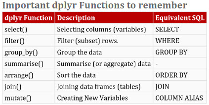

```{r setup, include=FALSE}
knitr::opts_chunk$set(echo = TRUE, warning = FALSE, message=FALSE)
```

```{r }
library(dplyr)
mydata <- read.csv('data/sampledata.csv')

#str(mydata)
#summary(mydata)
#dim(mydata)
#names(mydata)
#head(mydata)

```

## List each data type and associated variables

```{r}
# List out the data type of each variable or column
var.types <- sapply(colnames(mydata), function(x){class(mydata[[x]])}); var.types

# Identify the unique data types 
unique.types <- unique(var.types)

```


```{r}
# Group variables into respective data types
var <- lapply(unique.types, function(x){ names(var.types[var.types==x])})

# Assign a data type as the name of an associated column
names(var) <- unique(var.types)

# Show all data types and associated variables
for (i in  1:length(var)){ cat(names(var[i]),' = ',unlist(var[i]),'\n') }
```

```{r}
# Finad all factor variables
var.char <- sapply(colnames(mydata), function(x){class(mydata[x])})
```

## Sampling

```{r}
# Samepl random n rows
sample_n(mydata[1:5],3)

```

```{r}
# Sample random fraction of rows, here 5%
sample_frac(mydata[6:9], 0.05)
```

## Eliminating duplicates

```{r}
# Remove duplicate rows based on all variables
#d1 = distinct(mydata)

# Remove duplicate rows bbased on selected variables
# .keep_all is to retain all other variables in the output data frame
#d2 = distinct(mydata, var1, var2, .keep_all=TRUE)

```

## Queries



- Data

```{r}
names(mydata)
```

### SELECT variables/columns

```{r}
head( select(mydata, c('Index', 'Y2006':'Y2008')) )

```

- Select Based on Names


```{r}
# Drop variables
head( select(mydata, -starts_with('Y')) )

```

- Reordering Variables

```{r}
head( select(mydata, 'State', everything()) )

```

- Reanming Variables (Nondestructive)

```{r }
head( rename(mydata, 'ind'='Index') )

```

### Filtering or subsetting

```{r}
abc <- mydata %>% select(Index, State, Y2002) %>% 
filter( Index %in% c('A','C') & Y2002>=1650000 ); abc

```

- The **grepl** function, essentially like '**contain**', is used to search for pattern matching.

```{r}
# Output only those with 'Ar' in State variable
filter(abc, grepl('Ar',State))
```

## Ordeing

- arrange

```{r}
mydata %>% select(c(Index,Y2002:Y2004)) %>%  arrange(Index, Y2002) %>% head()
```

## Summarise

- summarise functions like mean, median, etc.

```{r}
summarise(mydata, Y2015_mean=mean(Y2015), Y2015_median=median(Y2015))
```

- summarise_at

```{r}
# For is.na, mean, median, etc. the examined object is passed in
summarise_at(mydata, vars(Y2014,Y2015), funs(n(),missing=sum(is.na(.)),mean(., na.rm=TRUE),median(., na.rm=TRUE)))
```

- subtract mean and calculate the variance

```{r}
set.seed(1-1)
# 
eg <- data.frame(X1=sample(1:100,100), X2=runif(100)) %>% summarise_at(vars(X1,X2), function(x){var(x - mean(x))}); eg

```

- summarise_if conditionally

```{r}
mydata %>% summarise_if(is.numeric, funs(n(),mean, median))

```

- summarise factor variable

```{r}
summarise_all( mydata['Index'], funs(nlevels(.),nmiss=sum(is.na(.))) )
```

## group_by

```{r}
#names(mydata)
mydata %>% group_by(Index) %>% summarise_at( vars(Y2002:Y2004), funs(n(),mean, median)) %>% head()
```

- Select 3rd maximum values

```{r}
# Find the maximums in selcted groups of a variables 
mydata %>% select(Index,Y2005, Y2007) %>% filter(Index %in% c('C','F','H')) %>% group_by(Index) %>% summarise(n(), max(Y2005), max(Y2007))
```

## mutate for creating a new variable

```{r}
mean(mydata$Y2008)
mydata %>% select(Index,Y2008) %>%  
mutate_if(is.numeric,funs('norm'=.-mean(.))) %>% head()
```

- Ranking among variables

By default, **min_rank()** assigns 1 to the smallest value and high number to the largest value. In case, you need to assign rank 1 to the largest value of a variable, use min_rank(**desc(.)**)

```{r}
mydata %>% select(Index,State,Y2008:Y2010) %>% mutate_at( vars(Y2008:Y2010), funs(Rank=min_rank(desc(.))) ) %>% arrange(Y2008_Rank) %>%  head()

```

- Highest income among State for Y2008 for each Index

```{r}
mydata %>% group_by(Index) %>% filter(min_rank(desc(Y2015))==1) %>%  select(Index,State,Y2015) %>%  head()
```

## JOIN

- Demo data sets

```{r}
df1 = data.frame(
  ID = c(1, 2, 3, 4, 5), 
  w = c('a', 'b', 'c', 'd', 'e'), 
  x = c(1, 1, 0, 0, 1), 
  y = rnorm(5), 
  z = letters[1:5])
df1

df2 = data.frame(
  ID = c(1, 7, 3, 6, 8), 
  a = c('z', 'b', 'k', 'd', 'l'),
  b = c(1, 2, 3, 0, 4), 
  c = rnorm(5),
  d = letters[2:6])
df2
```

### Various types of join

- inner_join(x,y,by= )

INNER JOIN returns rows when there is a match in both tables. In this example, we are merging df1 and df2 with ID as common variable (primary key).

```{r}

inner_join(df1,df2,by="ID")

```

- left_join(x,y,by= )

LEFT JOIN : It returns **all** rows from the left table, **even if there are no matches in the right table**.

```{r}
left_join(df1,df2,by="ID")

```

- right_join(x,y,by= )

```{r}

```

- full_join(x,y,by= )

full_join() returns all rows and all columns from both x and y.

```{r}
full_join(df1,df2,by='ID')
```

- semi_join(x,y,by= )

A semi join returns the rows of the first table where it can find a match in the second table.

```{r}
semi_join(df1,df2,by='ID')

```

- anti-join(x,y,by= )

An anti join returns the rows of the first table where it cannot find a match in the second table. 

```{r}
anti_join(df1,df2,by='ID')
```

Notice that the results of a semi_join plus the results of an anti_join give the orignial table. So, **regardless of the table contents or how you join them, semi_join(A, B) plus anti_join(A, B) will return A** (though maybe with the rows in a different order).

## Combining data vertically

```{r}
# Sample data
mtcars$model <- rownames(mtcars)
first <- mtcars[1:3,]
second <- mtcars[2:5,]

```

- **intersect(x,y)** returns rows appear in both, i.e. common to both x and y.

```{r}
intersect(first,second)
```

- **union(x,y)** returnd rows appear in either or both x and y. Namely, they are all rows from both the tables and removes duplicate records from the combined dataset. By using **union_all** function, it allows duplicate rows in the combined dataset.

```{r}
union(first,second)
union_all(first,second)
```

- **setdiff(x,y)** returns rows appear in x but not y.

```{r}
setdiff(first,second)
```

## IF ELSE

- **if_else**(condition, true, false, missing = NULL)

```{r}
df <- c(-10,2,NA)
if_else(df<0,'negative','positive',missing='missing value')
```

- Create a new variable with **if_else**

```{r}
mydf = data.frame(x=c(1:5,NA)) 
mydf %>% mutate(newvar=if_else(is.na(x),"I am missing", if_else(x==1,"I am one", if_else(x==2,"I am two", if_else(x==3,"I am three","Others")))))

```

## SQL-Style CASE WHEN Statement

We can use **case_when()** function to write nested if-else queries. In case_when(), you can use variables directly within case_when() wrapper. TRUE refers to ELSE statement.

**Make sure you set is.na() condition at the beginning in nested if_else. Otherwise, it would not be executed.**

```{r}
mydf %>% mutate(flag=case_when(
  is.na(x) ~ 'I am missing',
  x==1 ~ 'I am one',
  x==2 ~ 'I am two',
  x==3 ~ 'I am three',
  TRUE ~ 'others'))
```
## Automate model building

```{r}
by_cyl <- group_by(mtcars, cyl) 
models <- by_cyl %>% do(mod = lm(mpg ~ disp, data = .)) 
summarise(models, rsq = summary(mod)$r.squared ) 
models %>% do(data.frame( 
  var = names(coef(.$mod)),
  coef(summary(.$mod))
  ))
```


## IF family functions

- select_if
```{r}
names(mydata)
select_if(mydata[1:5], is.numeric) %>% head()
```
```{r}
select_if(mydata[1:5], is.factor) %>% head()
```

- summarise_if

```{r}
summarise_if(mydata, is.factor, funs(nlevels(.)))
```

- mutate_if
```{r}
mutate_if(mydata[1:5], is.numeric, funs("new" = .* 1000)) %>% head()
```

- na_if
```{r}
k <- c("a", "b", "", "d")
na_if(k, "")
```

## Normalization

```{r pressure, echo=FALSE}
#Mean Normalisation
#data$LotArea <- (data$LotArea - mean(data$LotArea , na.rm = TRUE))/sd(data$LotArea , na.rm = TRUE)

```
